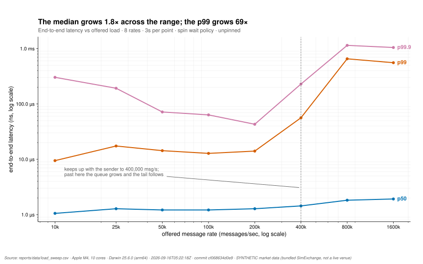
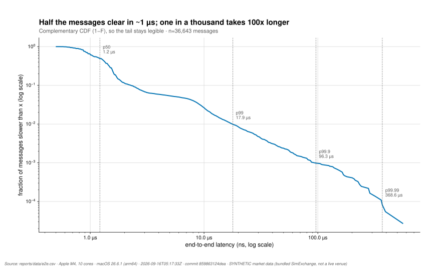
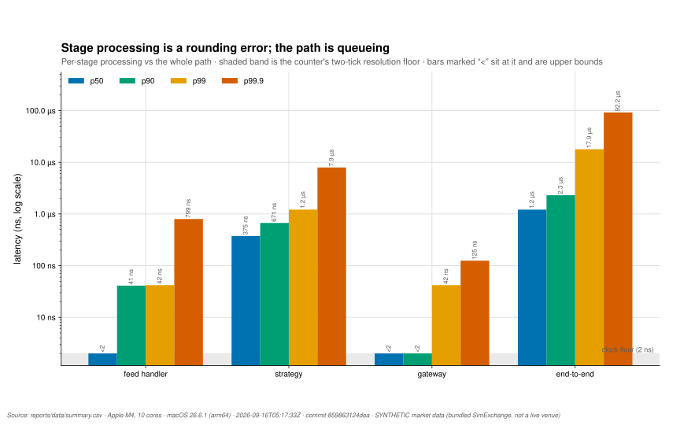
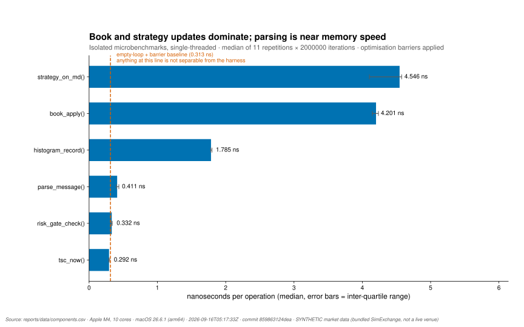
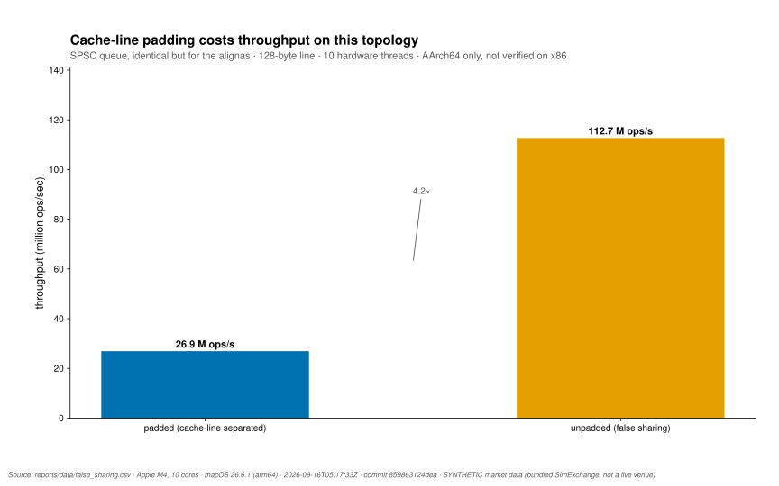

# hft-engine

A low-latency C++20 market-data-to-order pipeline: a feed handler, a flat-array
order book, an imbalance strategy and a pre-trade risk gate, wired together by
lock-free queues and instrumented end to end with a cycle counter.

[](https://github.com/leeyawnnn/high_frequency_trading_engine/actions/workflows/ci.yml)
[](LICENSE)
[](https://en.cppreference.com/w/cpp/20)

## Results

<!-- BEGIN GENERATED RESULTS -->
| measurement | value |
|---|---|
| end-to-end p50 / p99 / p99.9 | 1215 / 17919 / 92159 ns |
| order round trip p50 | 21503 ns |
| strategy stage p50 / p99 | 375 / 1215 ns |
| keeps up with offered load to | 400,000 msg/s |
| saturates at | 586,805 msg/s |
| `book_apply()` (order book update) | 4.201 ns |
| `strategy_on_md()` (strategy decision) | 4.546 ns |
| clock resolution | 1.000 ns (`arm-cntvct-el0`) |

Measured on Apple M4, 10 logical cores, macOS 26.6.1 (arm64), threads unpinned, spin wait policy, 4s at 100k msg/s, synthetic data over loopback UDP. `<N` means the span finished inside the clock's resolution floor and is an upper bound, not zero.

Full generated tables: [reports/tables.md](reports/tables.md). Regenerate everything with `scripts/measure.sh`.
<!-- END GENERATED RESULTS -->

The headline is the shape rather than any single number: per-stage processing
is tens to hundreds of nanoseconds, while end-to-end is microseconds. The gap
is queue wait and scheduler preemption on unpinned threads, not code. That is
what [`fig_latency_vs_load.svg`](reports/figures/fig_latency_vs_load.svg) is
for — it shows where the engine stops keeping up, which matters more than how
fast it is when nothing is wrong.

## Quickstart

```bash
cmake -S . -B build -DCMAKE_BUILD_TYPE=Release
cmake --build build -j
ctest --test-dir build --output-on-failure

# measure: writes reports/data/*.csv plus provenance, and renders the tables
scripts/measure.sh

# figures (needs matplotlib)
python3 reports/plot.py
```

Requires CMake ≥ 3.20 and a C++20 compiler. No third-party dependencies: the
test harness, the histogram and the JSON config parser are all in-tree.

Linux and macOS are supported and both are built and tested in CI, across GCC
and Clang, Debug and Release. **Windows is not supported** — the networking and
affinity layers are POSIX.

## What this is

A market-data pipeline is a chain of hand-offs, and in a trading system the
hand-offs cost more than the work. This repository exists to make that concrete
and measurable.

Three threads own three stages. The feed handler reads UDP datagrams, parses
fixed-size frames and stamps each message with the cycle counter at arrival.
The strategy maintains an order book and produces a signal from top-of-book
imbalance using integer arithmetic only. The gateway runs four pre-trade risk
checks, serialises an order and writes it to the wire. Between each pair sits a
single-producer/single-consumer ring buffer, so a hand-off is a cache-line
transfer rather than a lock or a system call.

Each stage is instrumented at both ends, so the report can attribute latency to
the stage that spent it, and the sum of stage times can be compared against the
end-to-end figure. The difference between those two is the interesting part:
it is the time messages spent waiting in queues and the time threads spent not
running.

The order book is a flat array indexed by price tick rather than a map. Within
a fixed price window an update is an array write and, in the worst case, a
short walk to find the next non-empty level. That trades memory and a bounded
price range for removing pointer chasing from the hot path.

```
                          exchange_sim  (separate process)
                ┌───────────────────────────────────────────────┐
                │  random-walk top-of-book + imbalances/crosses  │
                │  answers orders with fills (echoes e2e tag)    │
                └───────┬───────────────────────▲────────────────┘
       ITCH feed (UDP)  │ batched datagrams     │ orders (UDP)   ▲ fills (UDP)
                        ▼                        │                │
 ╔═══════════════════ hft-engine (one process, three pinned threads) ═══════════╗
 ║                                                                              ║
 ║   CORE A: feed handler      CORE B: strategy          CORE C: gateway        ║
 ║  ┌──────────────────┐      ┌──────────────────┐      ┌────────────────────┐  ║
 ║  │ recv → parse →   │ feed │ flat-array book  │order │ risk gate (4 checks)│  ║
 ║  │ tag(arrival TSC) │═════►│ imbalance signal │═════►│ in-flight table →   │──╫─► orders
 ║  │                  │ SPSC │ (integer math)   │ SPSC │ serialize → send    │  ║
 ║  └──────────────────┘      └──────▲───────────┘      └─────────┬──────────┘  ║
 ║                                   │  fill SPSC                 │ recv fills  ║
 ║                                   └────────────────────────────┘ ◄───────────╫─ fills
 ║                                                                              ║
 ╚══════════════════════════════════════════════════════════════════════════════╝
   ═════►  lock-free single-producer/single-consumer ring buffer (no locks, no syscalls)
```

## Method

**Queues** — [`include/hft/spsc_queue.hpp`](include/hft/spsc_queue.hpp).
Power-of-two capacity so index wrap is a mask. Monotonic 64-bit positions, so
empty and full need no spare slot. Each side caches the other's position and
only re-reads the atomic when its cache says the queue looks full or empty, so
in the common case neither thread touches the other's cache line. Acquire and
release on the positions publish the slot contents, so the payload itself needs
no atomics.

**Waiting** — [`include/hft/wait_policy.hpp`](include/hft/wait_policy.hpp). A
stage that finds no work spins, backs off, or decides based on whether it
actually got the core it asked for. The default is the last of those. This
matters more than it looks: on an unpinned machine the choice moves end-to-end
p50 by roughly 8x, so it is a runtime option and the report records which was
used.

**Timestamps** — [`include/hft/tsc.hpp`](include/hft/tsc.hpp). `rdtsc` on x86,
`cntvct_el0` on AArch64, calibrated once against `steady_clock` and
cross-checked against the frequency the hardware advertises. The measured tick
period is published with every result, and any figure below two ticks is
reported as `<N` rather than as a number.

**Book** — [`include/hft/book_view.hpp`](include/hft/book_view.hpp). Flat
arrays of size per side, indexed by tick offset from a base price. Prices
outside the window are counted and dropped rather than folded back in.

**Market data** — two formats.
[`include/hft/itch_message.hpp`](include/hft/itch_message.hpp) is a simplified
32-byte native-endian frame used by the loopback simulation, so the benchmark
measures the pipeline rather than byte swapping.
[`include/hft/itch50.hpp`](include/hft/itch50.hpp) decodes real Nasdaq
TotalView-ITCH 5.0 — big-endian, variable-length, six-byte timestamps, and the
order-reference bookkeeping that the simplified frame assumes away.

### ITCH 5.0 message coverage

| type | message | decoded | effect on the book |
|---|---|---|---|
| `A` | Add Order | yes | adds size at a level |
| `F` | Add Order with MPID | yes | same as `A`; attribution ignored |
| `E` | Order Executed | yes | reduces the referenced order |
| `C` | Order Executed with Price | yes | same reduction; exec price is tape-only |
| `X` | Order Cancel | yes | partial reduction |
| `D` | Order Delete | yes | removes the remaining size |
| `U` | Order Replace | yes | emitted as a delete plus an add |
| `P` | Trade (non-cross) | yes | none; never resting liquidity |
| `S` | System Event | yes | none; administrative |
| `R` | Stock Directory | yes | none; administrative |
| `H` | Stock Trading Action | yes | none; administrative |
| `Y` | Reg SHO Restriction | yes | none; administrative |
| `L` | Market Participant Position | yes | none; administrative |
| `Q` | Cross Trade | no | ignored; auction prints, not book updates |
| `B` | Broken Trade | no | ignored |
| `I` | NOII | no | ignored; imbalance feed is a separate concern |

MoldUDP64, the framing used by the live multicast feed, is not implemented.
The decoder reads the BinaryFILE framing of Nasdaq's downloadable day files:
a two-byte big-endian length before each message.

## Figures

All figures regenerate with `python3 reports/plot.py` and CI fails if any of
them stops rendering. See [reports/README.md](reports/README.md) for how to
read each one.



End-to-end latency against offered message rate. The vertical rule marks the
last rate at which the engine kept up with the sender. Read the knee, not the
level: past it, the queue grows and the tail follows, while the median barely
moves.



The complementary CDF of end-to-end latency, on log axes. Plotted as 1−F so
the tail stays legible; the labelled rules mark p50 through p99.99.



Per-stage processing against the whole path, with the clock's resolution floor
shaded. Bars labelled `<2` sit on that floor and are upper bounds. The gap
between the stages and end-to-end is the queueing.



Isolated hot-path costs with inter-quartile ranges, and the empty-loop barrier
baseline drawn as a reference line.



Padded against unpadded SPSC cursors. On this hardware the unpadded layout
wins, which is the opposite of the textbook result — see Limitations.

## Measurement methodology and its limits

Numbers here mean nothing without the conditions, so the conditions travel with
them: every artifact in `reports/data/` has a `.meta.json` recording the exact
command, the commit, the UTC timestamp, the CPU, the core count, the OS and the
load average at the start of the run.

**Clock.** The engine reports its own clock source, measured frequency, the
frequency the hardware advertises, the drift between them, and the resulting
tick period, at the top of every run. On the machine used here that is
`cntvct_el0` at 1.000 GHz, a 1 ns tick.

**The resolution floor is stated, not hidden.** Any percentile below two ticks
is printed as `<N`. A p50 of `0` would say a stage took no time; what it
actually means is that the stage finished inside one tick. The feed handler and
gateway medians are at that floor, so their true medians are unknown and only
bounded.

**Pinning.** macOS exposes no `pthread_setaffinity_np`, so the published run is
unpinned and says so. Pinning is implemented for Linux and reports its outcome
rather than failing silently, because a pin that quietly fails produces
plausible percentiles with scheduler noise folded into the tail.

**Wait policy.** The published run uses `--wait spin`. That is the low-latency
policy and it assumes a free core per stage. The engine's default is adaptive
— spin only if the thread got the core it asked for — which costs roughly 8x on
end-to-end p50 here and is the right default for a shared machine.

**Not configured:** `isolcpus`, `nohz_full`, a fixed frequency governor, or an
otherwise idle machine. The load average at the start of each run is in the
provenance block; it was not zero.

## Validation

- **Differential testing.** The flat-array book is checked against an
  obviously-correct `std::map` reference over 200,000 randomly generated
  messages, plus per-message invariants: a side reporting a best price has
  non-zero size there, top-of-book agrees with a direct lookup, and imbalance
  stays within [-1, 1].
- **Fuzzing.** libFuzzer targets drive the book and the frame reader with
  mutated bytes under ASan and UBSan, asserting the same invariants. CI runs
  each for 45 seconds per push.
- **Conformance.** The ITCH 5.0 decoder is tested against messages built
  byte-by-byte from the spec tables by an encoder written separately from the
  decoder, so a shared struct cannot make the test pass vacuously.
- **Real data.** Replaying the first 10.3 MB of `01302019.NASDAQ_ITCH50`
  decoded 359,802 messages with zero malformed frames, zero unresolved order
  references and zero invariant violations, producing 145,522 book updates.
- **Cross-checks between harnesses.** `book_apply` is measured by two
  independent benchmarks that agree to within about 5%.
- **Sanitizers.** ASan, UBSan and TSan jobs run the full suite on every push,
  with TSan aimed specifically at the lock-free queue.

## Limitations

I would not present any of the following as production-ready, and several of
the numbers above would change materially on different hardware.

- **This is a simulated exchange over loopback UDP, not a venue.** There is no
  matching engine worth the name, no market impact, no gateway queueing, no
  sequencer, and no recovery path for gaps. The round-trip figure measures a
  process on the same machine answering immediately.
- **No kernel bypass.** No DPDK, no Solarflare, no `io_uring`. Every datagram
  crosses the kernel boundary, so the network path is not representative of
  production and the loopback `sendto` ceiling of roughly 0.3 M datagrams/s is
  a property of the syscall, not of the engine.
- **The strategy is a toy.** Top-of-book imbalance over a threshold, one unit
  at a time, gated on having nothing in flight. It is there to give the
  pipeline something to decide, not to make money, and I have not backtested
  it against anything.
- **The published numbers are hardware-specific.** They come from an Apple M4
  with a 1 ns counter tick, unpinned. On x86 with a sub-nanosecond invariant
  TSC and isolated cores I would expect the per-stage medians to become
  measurable rather than floored, and the tail to tighten considerably once the
  scheduler is out of the way. I have not run that, so I am not claiming it.
- **The cache-line padding result is measured on AArch64 only** and is the
  opposite of the textbook answer. I believe the mechanism — Apple Silicon's
  clustered cores and 128-byte lines make one shared line cheaper to move than
  two separate ones — but a mechanism I find plausible is not evidence. Without
  an x86 run it should be read as a property of this machine.
- **The feed handler and gateway medians are below the clock's resolution.** I
  can say they are under 2 ns; I cannot say what they are. A finer counter or a
  batched measurement would be needed to put a number on them.
- **The engine is single-symbol.** The book is one flat array over one price
  window, and the ITCH decoder's order map is global rather than per-symbol.
  Multi-symbol support is a data-structure change, not a parameter.
- **Coordinated omission is not corrected for.** The load sweep drives at a
  fixed offered rate and measures service time, so the tails there are
  optimistic. I know what the correction is and have not implemented it.

### What I'd do differently

I would build the measurement before the engine. Almost every real problem
found in this repository was a measurement problem wearing a performance
result's clothes: component benchmarks whose working set made them a memory
bandwidth test, a table in the README that disagreed with the CSV beside it, a
clock whose resolution floor was being published as "0 ns", and two committed
CSVs that no program in the repository could regenerate. The code was mostly
fine. What it claimed about itself was not, and none of that was visible until
something tried to reproduce it.

The second thing is that I would treat a test that has to be disabled in one
configuration as a bug in the test. The end-to-end latency assertion here was
compiled out under sanitizers because they were too slow to meet it, and that
exemption was exactly the signal that it was measuring the machine rather than
the code. It failed for that reason in CI on hardware I had not anticipated.

## Data sources

| source | URL | as of | terms | how it is refreshed |
|---|---|---|---|---|
| Nasdaq TotalView-ITCH 5.0 specification | [NQTVITCHSpecification.pdf](https://www.nasdaqtrader.com/content/technicalsupport/specifications/dataproducts/NQTVITCHSpecification.pdf) | verified reachable 2026-09-16 | Nasdaq's; cited, not redistributed | manual |
| Nasdaq ITCH sample day files | [emi.nasdaq.com/ITCH/Nasdaq ITCH/](https://emi.nasdaq.com/ITCH/Nasdaq%20ITCH/) | 30 Jan 2019 file, fetched 2026-09-16 | Nasdaq's; **not redistributed here** | `scripts/fetch_itch_sample.py` |
| Engine latency and benchmark data | `reports/data/` | see each `.meta.json` | generated by this repository | `scripts/measure.sh` |

No market data is committed. A single ITCH day file is 4.76 GB, and it is
Nasdaq's to distribute rather than this project's, so `data/` is gitignored and
the fetch is a documented step. The historical FTP endpoint named in older
documentation (`ftp://emi.nasdaq.com/ITCH/`) no longer accepts connections; the
HTTPS path above is the working location.

All market data used in the published measurements is **synthetic**, generated
by the bundled `SimExchange`.

## Build options

| option | default | effect |
|---|---|---|
| `HFT_NATIVE` | `ON` | `-march=native`. Required for honest latency numbers; CI turns it off for portability. |
| `HFT_LTO` | `ON` | Link-time optimisation. |
| `HFT_WERROR` | `ON` | Warnings are errors. |
| `HFT_SANITIZE` | `OFF` | ASan + UBSan. Disables LTO. |
| `HFT_TSAN` | `OFF` | ThreadSanitizer. Disables LTO. |
| `HFT_BUILD_FUZZERS` | `OFF` | libFuzzer targets. Clang only; probes for the runtime and skips if absent. |
| `HFT_BUILD_TESTS` | `ON` | Unit tests. |
| `HFT_BUILD_BENCHMARKS` | `ON` | Microbenchmarks. |
| `HFT_BUILD_TOOLS` | `ON` | `latency_report`, `exchange_sim`, `itch50_replay`. |
| `HFT_BUILD_APPS` | `ON` | `hft_main`. |

## References

- Nasdaq. *TotalView-ITCH 5.0 Specification.* Message formats and field layouts
  in `include/hft/itch50.hpp` follow sections 4.1–4.5.
- Gil Tene. *How NOT to Measure Latency.* The source of the coordinated-omission
  problem described under Limitations.
- Tene, G. *HdrHistogram.* The bucketing scheme in
  `include/hft/histogram.hpp` is the log-linear design described there;
  percentiles are bucket upper bounds, which is why they can exceed the largest
  observed sample.
- Intel. *Intel 64 and IA-32 Architectures Software Developer's Manual*, Vol. 3B
  §17.17, on the invariant TSC and why `rdtscp` plus `lfence` is the
  serialising form.
- ARM. *ARM Architecture Reference Manual for A-profile*, on `CNTVCT_EL0` and
  `CNTFRQ_EL0`.

## Licence

Apache-2.0. See [LICENSE](LICENSE).
