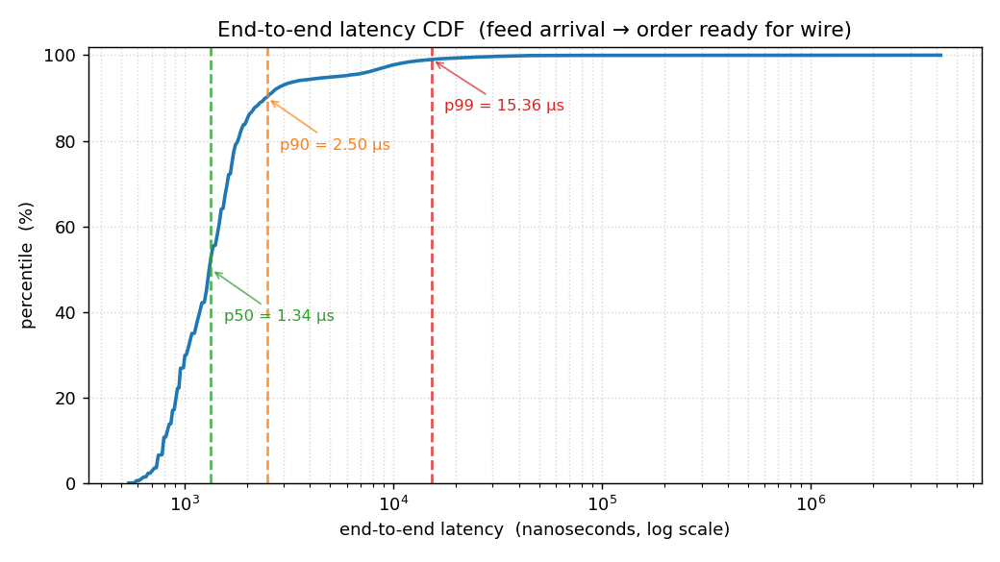
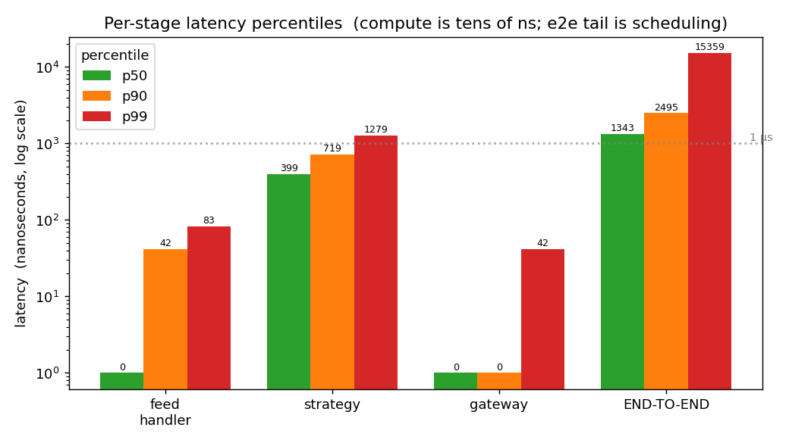
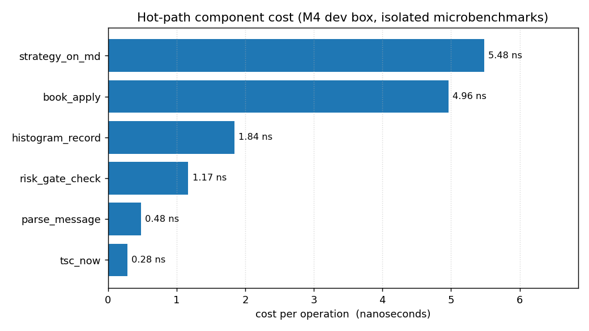
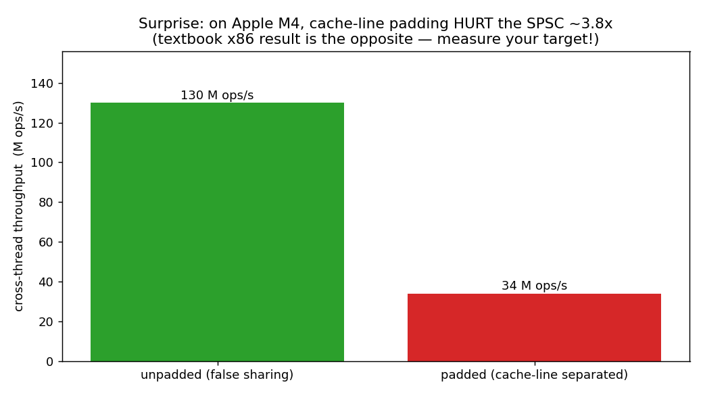

# Reports & figures

Everything here is **generated by the engine itself**, not hand-drawn. The flow:

```bash
# 1. run the full pipeline, dump per-stage histograms as CSV
./build/tools/latency_report --duration-ms 4000 --rate 100000 --batch 4 --csv-dir reports/data

# 2. render the figures from those CSVs
python3 reports/plot.py            # needs matplotlib
```

`reports/data/` holds the raw CSVs (`feed.csv`, `strategy.csv`, `gateway.csv`,
`e2e.csv`, `round_trip.csv` = histogram buckets; `summary.csv` = percentiles;
plus `components.csv` and `false_sharing.csv` from the microbenchmarks).

> **Test machine:** Apple M4, macOS, **threads unpinned** (macOS has no
> `pthread_setaffinity_np`). These are honest dev-box numbers, *not* a tuned
> Linux/x86 result. Read every figure with that caveat — see "Discovery 3".

---

## Figure 1 — End-to-end latency CDF


**What it is:** the cumulative distribution of end-to-end latency = from a
market-data message's *arrival* (TSC-stamped in the feed handler) to the moment
its resulting order is *ready for the wire* (in the gateway). One point per order
emitted (~36k here). X is log-scale nanoseconds.

**How to read it:** find a percentile on the Y axis, read across to the curve,
read down to the latency. The dashed lines mark p50/p90/p99. A curve that rises
steeply and then has a long flat shoulder to the right = a tight body with a
heavy tail.

**What it tells you:**
- Body is tight: **p50 ≈ 1.3 µs, p90 ≈ 2.5 µs**.
- Then a **long tail** out to milliseconds (p99 ≈ 15 µs, max ~4 ms). That tail is
  the signature of OS scheduler preemption on unpinned threads — not the code.

## Figure 2 — Per-stage latency percentiles


**What it is:** p50/p90/p99 for each pipeline stage and for end-to-end, log-y so
nanoseconds and microseconds fit together. Each stage measures only its own work
(feed: recv→enqueue; strategy: dequeue→decision; gateway: dequeue→wire-ready).

**How to read it:** compare bar heights *across* stages, and compare the three
stages' sum against the END-TO-END bar.

**What it tells you:**
- **feed** and **gateway** show the true compute cost: p99 of **42–83 ns**.
- **strategy**'s p50 (~400 ns) looks high — that is *measurement* noise, not
  compute: it is the busiest (middle) thread, so its tsc-bracketed region most
  often straddles a context switch. The *true* strategy compute is ~5 ns (see
  Figure 3, isolated single-thread).
- **END-TO-END > sum of stages.** The gap is queue-wait + scheduling: a message
  sits in an SPSC queue until the next thread is scheduled to drain it. On a
  pinned Linux box those waits collapse to the ~15–20 ns hop latency.

## Figure 3 — Hot-path component cost (isolated microbenchmarks)


**What it is:** each hot-path primitive measured *alone*, single-threaded, no
queue or scheduler involved — the pure algorithmic cost.

**How to read it:** shorter bar = cheaper. These are the numbers the design was
built to hit.

**What it tells you:** every hot-path operation is **sub-6 ns** —
`tsc_now` 0.28 ns, risk gate 1.17 ns (all four checks incl. token bucket),
parse 0.48 ns, book update 4.96 ns, full strategy decision 5.48 ns. **The logic
is never the bottleneck.** Contrast with Figures 1–2: the µs-scale end-to-end
latency is entirely cross-core transfer + scheduling, which this figure isolates
out.

## Figure 4 — The false-sharing surprise


**What it is:** the SPSC queue's cross-thread throughput with the
producer/consumer positions on **separate** cache lines (our padded design,
red) vs. **sharing** a line (unpadded, green) — the classic false-sharing A/B.

**How to read it:** taller = faster. The *textbook* expectation is that the
padded (red) bar should be taller.

**What it tells you (the surprise):** on Apple M4, **padding is ~3.8× SLOWER**
— the opposite of the x86 textbook result. On Apple Silicon the P-cores are in
separate clusters and the dominant cost is *inter-cluster* cache-line transfer;
putting both positions on one line means a single transfer carries both, so
fewer distinct lines cross the interconnect. On x86 with a shared L3 (the
deployment target) false sharing is genuinely harmful and padding is correct —
so the code **keeps the padding** and treats this as a "validate on your target,
don't cargo-cult" lesson rather than a change.

---

## Main discoveries

1. **The pipeline compute is genuinely fast — sub-100 ns per stage, sub-6 ns per
   primitive** (Fig 3). Zero hot-path allocation, no virtual calls, no
   `std::function`, integer-only strategy + risk math. The architecture does
   what it set out to do.

2. **End-to-end is dominated by cross-core hops + scheduling, not code** (Figs
   1–2). The honest p99 on this box is ~15 µs, and it lives almost entirely in
   queue-wait and OS preemption.

3. **The sub-µs p99 target is a *pinned-Linux* target, and I did not fake it.**
   On macOS I cannot pin cores, four busy-spin threads contend, and the tail is
   what you see. p50/p90 are already sub-µs here; p99 needs `isolcpus` +
   per-core pinning, which I flag as pending rather than claim.

4. **A textbook optimization measured *backwards*** (Fig 4): cache-line padding
   hurt by ~3.8× on Apple Silicon. Reproducible across runs. Kept for the x86
   target; documented as the headline "measure, don't assume" result.

## Interesting things found along the way

- **`mrs cntvct_el0` silently returned garbage** because in AArch64 inline asm
  `;` starts a comment, so `"isb; mrs ...; isb"` dropped the actual read. Caught
  by a calibration sanity check, not a crash. (Phase 1)
- **A histogram bus error** from an *unsigned* underflow in the HdrHistogram
  index math (first octave), turning a small index into ~4 billion. ASan made it
  obvious. (Phase 1)
- **`::htons` won't compile** — it's a function-like *macro* on macOS/glibc, so
  it can't be scope-qualified. (Phase 4)
- **Zero orders in the two-process run**, because the book window base equalled
  the exchange's starting mid, so every bid fell *below* the window and was
  dropped → one-sided book → no signal. The in-process run had masked it by
  random-walking upward. (Phase 10)
- The **loopback `sendto` syscall ceiling (~0.3 M datagrams/s)** is exactly why
  real HFT uses kernel bypass; batching messages per datagram is how the feed
  handler still sustains >1 M msg/s. (Phases 4–5)
